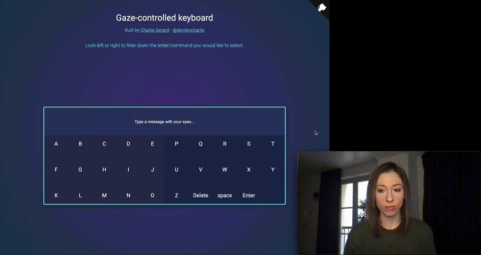

# Gaze-detection

Use machine learning in JavaScript to detect eye movements and build gaze-controlled experiences!

## Demo

Visit [https://gaze-keyboard.netlify.app/](https://gaze-keyboard.netlify.app/) _(Works well on mobile too!!)_ 😃



_Inspired by the Android application ["Look to speak"](https://play.google.com/store/apps/details?id=com.androidexperiments.looktospeak)._

Uses Tensorflow.js's [face landmark detection model](https://www.npmjs.com/package/@tensorflow-models/face-landmarks-detection).

## Detection

This tool detects when the user looks right, left, up and straight forward.

## How to use

### Install

As a module:

```bash
npm install gaze-detection --save
```

or using a CDN:

```html
<script src="https://cdn.jsdelivr.net/npm/gaze-detection@1.1.0/dist/index.min.js"></script>
```

### Code sample

If imported as a module, start by importing it:

```js
import gaze from "gaze-detection";
```

Load the machine learning model:

```js
await gaze.loadModel();
```

Then, set up the camera feed needed for the detection. The `setUpCamera` method needs a `video` HTML element and, optionally, a camera device ID if you are using more than the default webcam.

```js
const videoElement = document.querySelector("video");

const init = async () => {
  // Using the default webcam
  await gaze.setUpCamera(videoElement);

  // Or, using more camera input devices
  const mediaDevices = await navigator.mediaDevices.enumerateDevices();
  const camera = mediaDevices.find(
    (device) =>
      device.kind === "videoinput" &&
      device.label.includes(/* The label from the list of available devices*/)
  );

  await gaze.setUpCamera(videoElement, camera.deviceId);
};
```

Run the predictions:

```js
const predict = async () => {
  const gazePrediction = await gaze.getGazePrediction();
  console.log("Gaze direction: ", gazePrediction); //will return 'RIGHT', 'LEFT', 'STRAIGHT' or 'TOP'
  if (gazePrediction === "RIGHT") {
    // do something when the user looks to the right
  }
  let raf = requestAnimationFrame(predict);
};
predict();
```

Stop the detection:

```js
cancelAnimationFrame(raf);
```
